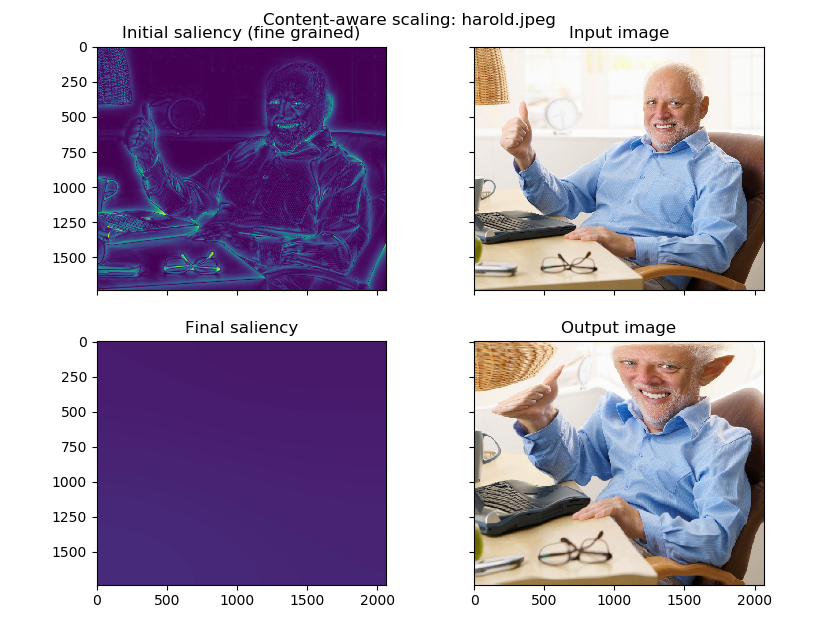

# pochow

Content-aware image resizing using the heat equation.

Usage:
```bash
python3 pochow.py [-h] -i INPUT -o OUTPUT [-s] [-p]
```

Example:
```bash
python3 pochow.py -i docs/harold_input.jpeg -o result.png
```



The method is explained in [docs/explanation.pdf](docs/explanation.pdf).
