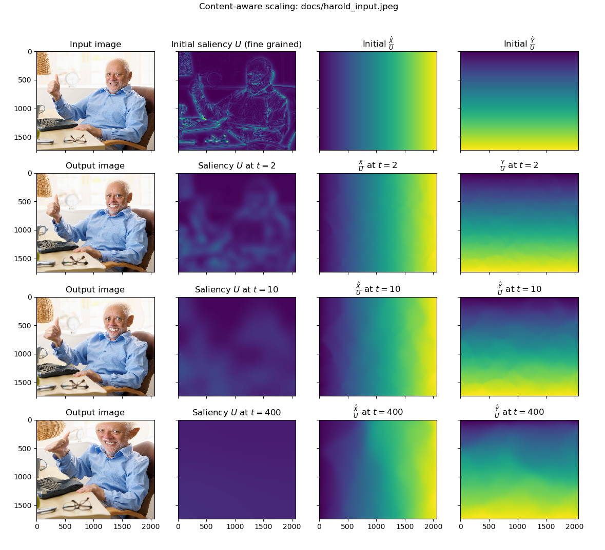

# Explanation

## Functions

The method receives an image $M$ as input, which in this explanation we will asssume to be stretched to fill the $[0,1] \times [0,1]$ domain.

The method works using 3 functions:
$$
U,\hat{X},\hat{Y} : \quad [0,1]\times[0,1]\times {R}^{+}_0  \rightarrow \mathbb{R}^{+}_0
$$

The saliency $U$ starts in $t{=}0$ calculated from the image:
$$
U(x,y,0) = \text{Saliency}(M)(x,y) + \varepsilon
$$
where $\varepsilon$ is a relatively small constant that can be added so low information areas of the image are not totally ignored.

For calculating the saliency, different methods can be used, see for instance [the ones provided by OpenCV](https://towardsdatascience.com/opencv-static-saliency-detection-in-a-nutshell-404d4c58fee4).

The X-osity $\hat{X}$, with initial condition in $t{=}0$:
$$
\hat{X}(x,y,0) = x \, U(x,y,0)
$$

The Y-osity $\hat{Y}$, with initial condition in $t{=}0$:
$$
\hat{Y}(x,y,0) = y \, U(x,y,0)
$$

## Difussion

The saliency is diffused using the heat equation:
$$
\frac{\delta U}{\delta t} = \alpha \left(\frac{\delta^2 U}{\delta x^2} + \frac{\delta^2 U}{\delta y^2} \right)
$$
with [Neumann boundary conditions](https://en.wikipedia.org/wiki/Neumann_boundary_condition#PDE).

The functions are discretized in a finite grid. A small variation of finite differences is used:

On each time step $t$, the amount of saliency $\Delta U_{i \rightarrow j, t}$ transferred from a cell $i$ to another cell $j$ is given by:
$$
\Delta U_{i \rightarrow j,t} = \alpha \max(U_{i,t} - U_{j,t},0) \, U_{i,t}
$$
So, the saliency of cell $i$ in the next step is given by:

\begin{align*}
U_{i,(t+1)} &= U_{i,t} +
\\ & \Delta U_{a \rightarrow i,t} - \Delta U_{i \rightarrow a,t} +
\\ & \Delta U_{b \rightarrow i,t} - \Delta U_{i \rightarrow b,t} +
\\ & \Delta U_{c \rightarrow i,t} - \Delta U_{i \rightarrow c,t} +
\\ & \Delta U_{d \rightarrow i,t} - \Delta U_{i \rightarrow d,t}
\end{align*}
where $a,b,c,d$ are the cells adjacent to $i$ in the grid.

Smaller values of $\alpha$ make the simmulation more stable and precise, but slower.

Each time an amount of saliency $\Delta U_{i\rightarrow j,t}$ is transferred from a cell $i$ to another cell $j$, a proportional amount of the X-osity and Y-osity are transferred along with it:
$$
\Delta \hat{X}_{i \rightarrow j,t} = \frac{\Delta U_{i \rightarrow j,t}}{U_{i,t}} \hat{X}_{i,t}
$$

$$
\Delta \hat{Y}_{i \rightarrow j} = \frac{\Delta U_{i \rightarrow j}}{U_{i}} \hat{Y}_i
$$
$\hat{X}_{i,(t+1)}$ and $\hat{Y}_{i,(t+1)}$ are obtained analogously to $U_{i,(t+1)}$

Once enough iterations are performed, the saliency  is expected to be appoximately constant:
$$
\lim_{t \rightarrow \infty} U(x,y,t) = C \qquad \text{, with $C$ constant.}
$$
so the amount of detail of the image is distributed evenly.

To build the final image $M'$, the final X-osity and Y-osity should be used to obtain coordinates of the pixels from the original image $M$ that have to be queried.
$$
M'(x,y) = M\left( \frac{\hat{X}(x,y,\infty)}{U(x,y,\infty)}, \frac{\hat{Y}(x,y,\infty)}{U(x,y,\infty)}\right)
$$
linear interpolation can be used to obtain the color of positions between the pixels.

